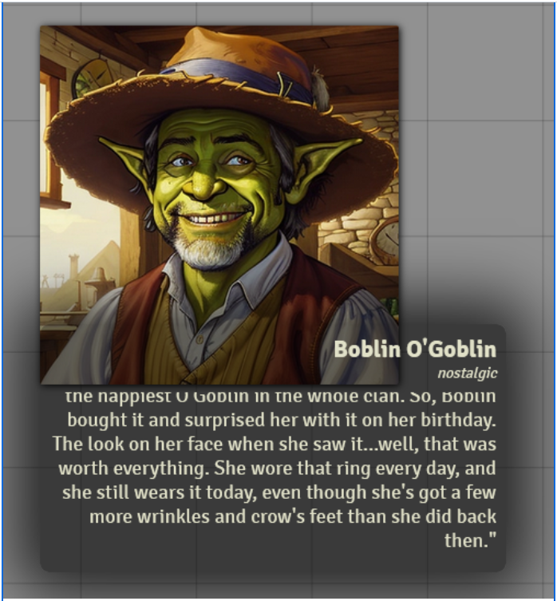

# VINO - Visual Interactive Novel Overlay


[](https://forge-vtt.com/bazaar#package=vino)


[](https://www.foundryvtt-hub.com/package/vino/)


[](https://weblate.foundryvtt-hub.com/engage/vino/)


ViNo is a module designed to offer a visual novel themed chat replacement system.




## NOTE: This module is **under maintenance**, I have no plans to update or add features. However, I will try to fix any bugs as possible. Any contribution is welcome.

For those who would like to support this module there are two ways to get it to help 4535992 with his VINO integration directly on the [Theatre](https://github.com/League-of-Foundry-Developers/fvtt-module-theatre), or support cswendrowski's patreon here [Iron Moose Development](https://www.patreon.com/ironmoose/posts).
If you are feeling particularly generous you can also buy 4535992 a coffee here [4535992](https://www.patreon.com/p4535992)

### Support the development: [](https://www.patreon.com/ironmoose)

### Buy a coffe to 4535992: [](https://www.patreon.com/p4535992)

## Installation

It's always better and easier to install modules through in in app browser.

To install this module manually:
1. Inside the Foundry "Configuration and Setup" screen, click "Add-on Modules"
2. Click "Install Module"
3. In the "Manifest URL" field, paste the following url:
`https://raw.githubusercontent.com/cswendrowski/FoundryVTT-ViNo/master/src/module.json`
4. Click 'Install' and wait for installation to complete
5. Don't forget to enable the module in game using the "Manage Module" button

### Features

#### Chat commnads for different image and font

```
/vino [emote key]
```

# Build

## Install all packages

```bash
npm install
```

### dev

`dev` will let you develop you own code with hot reloading on the browser

```bash
npm run dev
```

### build

`build` will build and set up a symlink between `dist` and your `dataPath`.

```bash
npm run build
```

### build:watch

`build:watch` will build and watch for changes, rebuilding automatically.

```bash
npm run build:watch
```

### prettier-format

`prettier-format` launch the prettier plugin based on the configuration [here](./.prettierrc)

```bash
npm run-script prettier-format
```

### lint

`lint` launch the eslint process based on the configuration [here](./.eslintrc.json)

```bash
npm run-script lint
```

### lint:fix

`lint:fix` launch the eslint process with the fix argument

```bash
npm run-script lint:fix
```


## [Changelog](./changelog.md)

## Issues

Any issues, bugs, or feature requests are always welcome to be reported directly to the [Issue Tracker](https://github.com/cswendrowski/FoundryVTT-ViNo/issues ), or using the [Bug Reporter Module](https://foundryvtt.com/packages/bug-reporter/).

## License

This package is under an [GPL-3.0](LICENSE) and the [Foundry Virtual Tabletop Limited License Agreement for module development](https://foundryvtt.com/article/license/).
